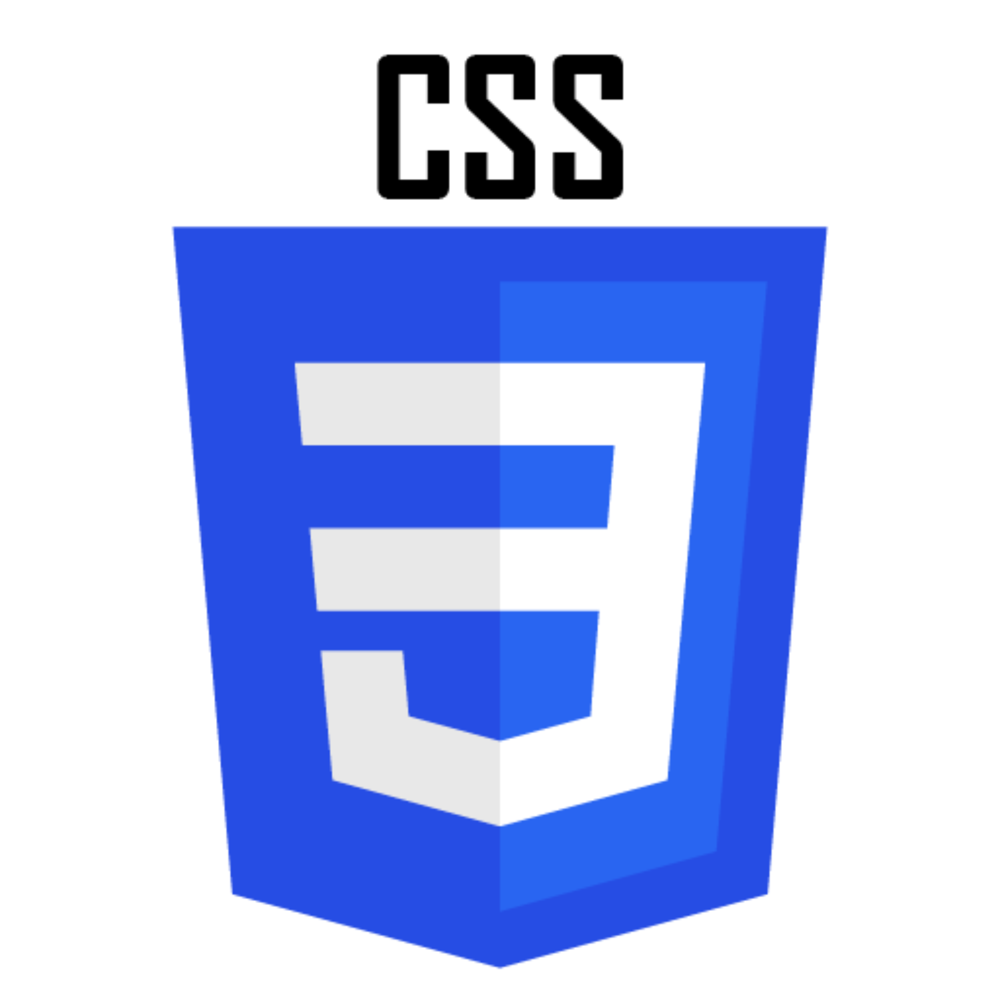

# Front-End Practice Projects

Welcome to the **Front-End Practice Projects** repository! This collection is designed to help you enhance your front-end development skills through practical, hands-on projects. Each folder in this repository corresponds to a unique projects, covering a range of essential web development concepts and techniques.

Below you'll find an overview of each project folder. For a more engaging experience.

---

## Project Folders

### 1. `01_HTML-Beginner-projects`

  

> **Description:** Build beginner-friendly HTML projects to practice basic structure, elements, and semantic markup. Great for those starting with web development.

### 2. `02_CSS-Beginner-Projects`

  

> **Description:** Practice CSS fundamentals with beginner-friendly projects. Learn about selectors, properties, and layouts.

### 3. `03_JS-Fundamentals-Exercises`

  

> **Description:** Strengthen your JavaScript basics with hands-on exercises and mini-projects.

### 4. `04_SASS-Projects`

  

> **Description:** Explore SASS features and workflows through practical styling projects.

### 5. `05_Tailwind-projects`

  

> **Description:** Build UI components and layouts using Tailwind CSS utility classes.

### 6. `06_Beginner-Friendly-FrontEnd-projects`

  

> **Description:** A collection of simple, beginner-friendly front-end projects to boost your confidence.

### 7. `07_React-Beginner-Projects`

  

> **Description:** Start your React journey with easy-to-follow beginner projects.

### 8. `08_FrontEnd-Advanced-Projects`

  

> **Description:** Challenge yourself with advanced front-end projects and modern web techniques.

---

## Contribution

Feel free to explore, learn, and contribute your own projects!

---

Happy coding! 🚀
